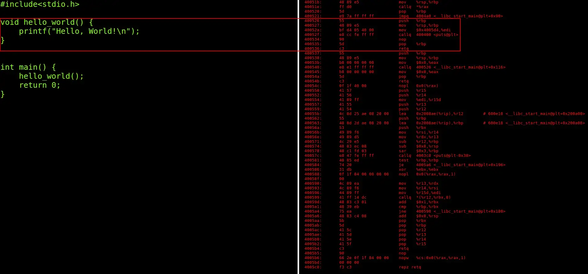

# CNN For Function Identification

Article: [CNN for Reverse Engineering: an Approach for Function Identification](https://medium.com/@alon.stern206/cnn-for-reverse-engineering-an-approach-for-function-identification-1c6af88bca43)

## Usage

To download the dataset to the current directory run the command:
> wget — recursive — no-parent — reject html,signature [http://security.ece.cmu.edu/byteweight/elf_32](http://security.ece.cmu.edu/byteweight/elf_32/)

To run the program run:
> python3 main.py \<dataset path\>

